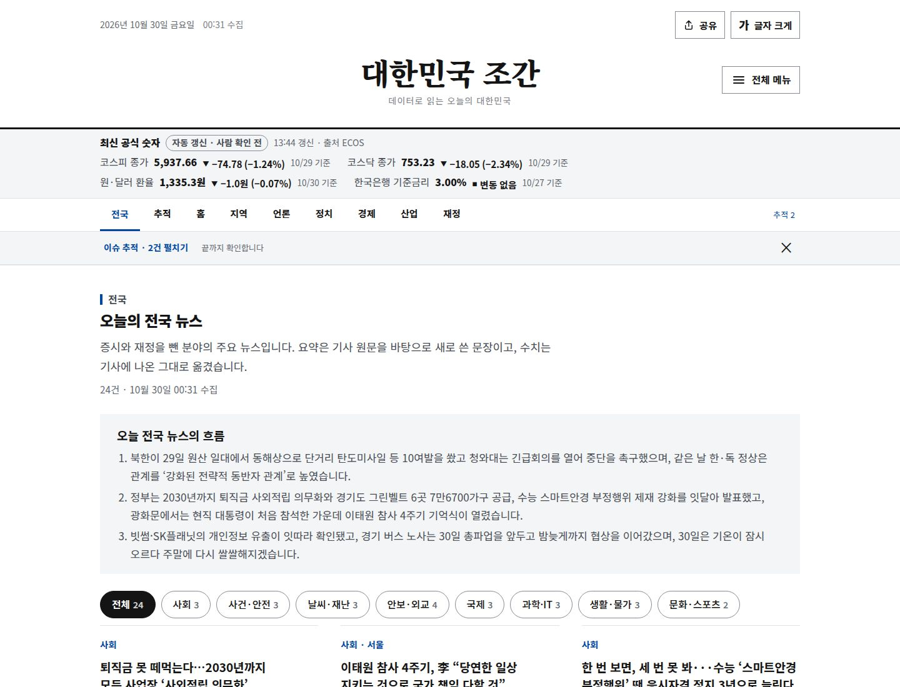
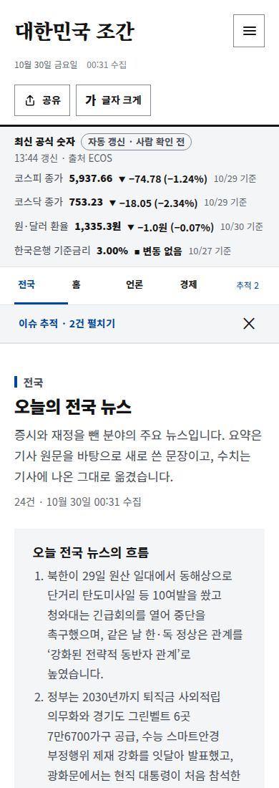

# 대한민국 조간

**전국 뉴스와 장기 이슈, 주요 공식 수치를 출처와 기준일을 확인하며 읽을 수 있는 데이터 신문입니다.** 기사마다 다른 수치는 집계 기간과 기준을 함께 보여 주고, 사람이 확인한 호와 자동 발행한 호를 구분해 표시합니다.

[서비스](https://korea-jogan.com/) · [운영 화면](https://korea-jogan.com/admin/) · [문서 안내](docs/README.md) · [프로젝트 Notion](https://www.notion.so/3ffcbbdd109b8167a28dd65769e55676) · [Figma](https://www.figma.com/design/Eep2qLjiPT9jhDUyLU8Zjx)

## 어떤 문제를 풀었는가

같은 사건을 다뤄도 집계 기간이나 비교 시점에 따라 수치가 달라질 수 있습니다. 숫자만 보여 주면 독자가 근거를 확인하기 위해 원문을 다시 찾아야 합니다. 그래서 **값·출처·기준일·확인 범위를 함께 제공하는 것**을 중심으로 설계했습니다. 하루 한 호를 전국 → 이슈 추적 → 홈 → 지역 → 언론 → 정치 → 경제 → 산업 → 재정의 9개 섹션으로 구성하고, 40~50대 독자가 PC에서는 나란히 비교하고 모바일에서는 핵심부터 읽도록 배치했습니다.

개인 프로젝트로 기획부터 정보 구조와 UI, 데이터 규격, 검사·배포 흐름까지 구성했습니다. AI는 자료 조사·초안·삽화에 활용하며, 자동 검사와 사람의 원문 대조를 구분해 기록합니다.

| 담당 영역 | 구현과 판단 | 문서 |
| --- | --- | --- |
| 서비스 기획 | 하루 한 호, 9개 섹션, 출처·정정·확인 상태 공개, 호 상태와 확인 주체 | [기획](docs/planning/01-product.md) |
| UX/UI·퍼블리싱 | PC 비교 배치와 모바일 핵심 정보 우선, 읽기 설정·키보드 탐색·패널 닫기와 포커스 복귀 | [디자인 가이드](design/guide.md) · [브랜드 자산](design/illustrations.md) |
| 프론트엔드 | JSON 렌더링, 공통 탐색·반응형 펼침, 오류 복구, 지연 로딩 슬라이드 | [기술 구조](docs/dev/architecture.md) |
| 데이터·운영 | 데이터 검사, 사람 확인/자동 공개, 정정, 호별 페이지·RSS·배포 | [데이터 규격](docs/planning/data-spec.md) · [런북](docs/planning/runbook.md) |

## 자료가 공개되기까지

조사·편집한 자료는 날짜별 JSON으로 저장합니다. Python 검사를 거친 뒤 해당 호의 HTML·RSS·사이트맵을 생성합니다. 일일 발행은 **검사한 일일 SHA의 데이터만 안정 코드에 반영**해 개발 중인 기능이 공개되지 않도록 했습니다. 검사 실패·오늘 호 누락·브랜치 충돌이 있으면 발행을 중단하고, 배포 후에도 공개 데이터의 날짜·상태·소스 SHA를 대조합니다.

사람이 원문과 대조한 호는 '편집자 확인', 자동 검사만 거쳐 공개한 호는 '자동 발행'으로 표시합니다. 발행한 본문·현재의 이슈 추적·별도 갱신하는 최신 숫자·정정 기록은 데이터 파일을 나눠 관리합니다. 각 필드와 확인 상태의 의미는 [데이터 규격](docs/planning/data-spec.md), 읽고 쓰는 코드의 관계는 [데이터 지도](docs/dev/architecture.md#데이터-지도)에 있습니다.

예약 시각·발행 절차·장애 추적은 [런북](docs/planning/runbook.md), 브랜치·워크플로·개발 미리보기는 [브랜치·환경·배포](docs/dev/branches.md), 실제 복구 이력은 [변경 기록](docs/dev/changelog.md)에 있습니다.

## 기술과 실행

화면은 HTML·CSS·바닐라 JavaScript로 구현했고, 데이터 수집·검사·생성에는 Python 3.12를 사용합니다. Node.js 22는 검사 도구 실행에 사용합니다. 프레임워크·번들러·상시 서버·DB 없이 운영은 GitHub Pages, 개발 검토는 인증 보호된 Vercel에서 합니다. Swiper는 [라이선스·버전을 기록](dev/web/assets/vendor/swiper/README.md)해 로컬에 둡니다. 선택 이유와 제약은 [설계 트레이드오프](docs/dev/architecture.md#설계-트레이드오프)에 정리했습니다.

```bash
python3 -m http.server -d dev/web 8000            # http://localhost:8000
python3 dev/pipeline/publish/validate.py          # 데이터 검사
python3 dev/pipeline/build/build_tokens.py --check
python3 -m unittest discover -s dev/tests
cd dev/tests/browser && npm ci && npx playwright install chromium && npm test
```

ECOS 키는 GitHub Secrets `ECOS_API_KEY`로 관리하며 키·토큰을 저장소에 넣지 않습니다. 운영 화면의 Google OAuth·GA4·검색 연결은 [관리자 연결 안내](docs/dev/ga4-admin.md)를 따릅니다.

| 찾는 내용 | 위치 |
| --- | --- |
| 화면·공통 로직·섹션별 구현 | [dev/web/src/](dev/web/src/) |
| 수집·검사·페이지 생성 | [dev/pipeline/](dev/pipeline/) |
| 자동 검사 | [dev/tests/](dev/tests/) |
| 디자인 토큰·삽화·공유 이미지 | [design/](design/) |
| 작업 규칙 | [AGENTS.md](AGENTS.md) · [커밋 기준](docs/dev/commits.md) |

## 한계와 다음 과제

- **자료 수집:** ECOS·RSS 수집기는 구현했지만, 모든 지표를 API로 수집하는 것은 아닙니다. KOSIS·관세청·국회 수집은 후속 과제입니다.
- **검사의 범위:** 형식·하위 필드·링크 형태·호 상태 검사가 원문의 진위와 계산 정확성까지 보증하지 않습니다. 공개 이후에도 대조와 정정이 필요합니다.
- **측정:** GA4·검색 실적 조회를 구현했으나 실제 이용 흐름으로 독자 가설을 검증하는 일은 별도 과제입니다([검색·소개·재방문 운영](docs/planning/growth.md)).
- **호스팅:** GitHub Pages는 메타 CSP만 가능하며 응답 헤더가 필요한 보안 기능은 미설정입니다.

## 이전 화면

2026.10.30 당시 운영 화면입니다. 최신 배치는 [디자인 가이드](design/guide.md)를 따릅니다.

<table>
<tr><th>PC · 2026.10.30</th><th>모바일 · 2026.10.30</th></tr>
<tr><td></td><td></td></tr>
</table>

## 이용 조건

코드는 [MIT](LICENSE), 서비스에서 직접 작성한 글은 CC BY 4.0입니다. 기사·통계 등 원자료의 이용 조건은 각 권리자·기관을 따릅니다.
