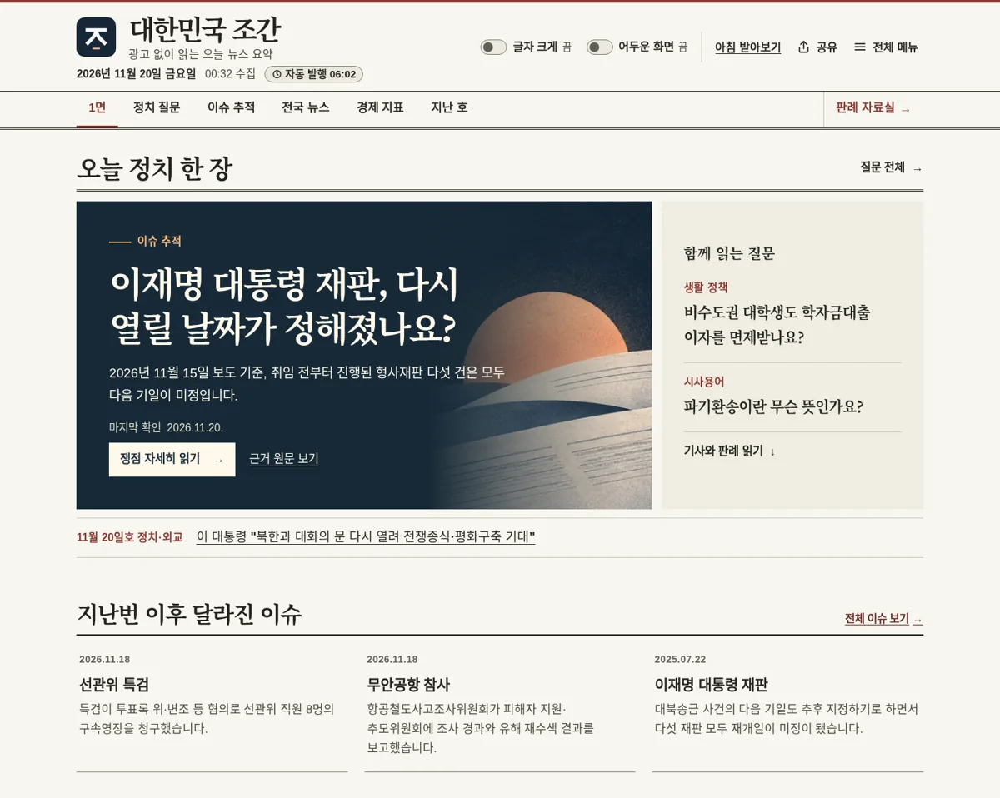
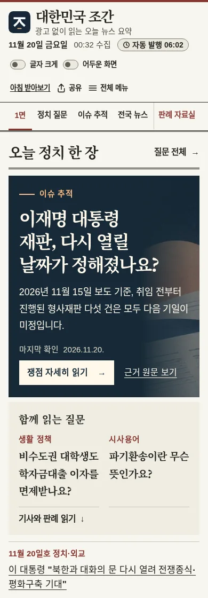

# 대한민국 조간

**뉴스에서 생긴 질문을 기사·판결문·법령 원문까지 따라가며 읽는 광고 없는 데이터 신문입니다.** 예를 들어 ‘파기환송이 무슨 뜻인가요?’로 들어온 독자는 한 줄 설명을 읽고, 실제 판결 주문에서 어느 법원이 다음 재판을 맡는지 확인할 수 있습니다.

**곽민상 · 1인 기획·UI 설계·프론트엔드 개발·운영**

HTML, CSS, 바닐라 JavaScript로 화면을 구현하고 Python으로 발행할 HTML과 데이터를 생성합니다. GitHub Actions에서 검사한 뒤 GitHub Pages로 공개합니다.

[운영 서비스](https://korea-jogan.com/) · [파기환송 직접 읽기](https://korea-jogan.com/politics/reversal-and-remand/) · [Notion 프로젝트 소개](https://app.notion.com/p/3ffcbbdd109b8167a28dd65769e55676)

## 대표 구현 세 가지

| 독자가 겪는 상황 | 설계·구현한 내용 | 확인할 자료 |
| --- | --- | --- |
| 판례의 정식 명칭을 몰라 같은 내용을 다시 검색해야 합니다. | ‘전세금’과 ‘임대차보증금’처럼 생활어와 법률 용어를 연결했습니다. 결과에 사건번호·선고일을 표시하고 해당 판결문을 바로 엽니다. | [전세보증금 사례](https://korea-jogan.com/law/?issue=rental-deposit) · [검색 규칙](dev/web/law/search-core.js) |
| 키보드로 판결문 문제를 풀 때 어떤 답을 선택했고 다음에 무엇을 할 수 있는지 알아야 합니다. | 라디오 버튼으로 답을 선택하고, 선택 없이 확인하면 첫 선택지로 포커스를 보냅니다. 결과는 보조기기에 알리고, 자바스크립트를 꺼도 해설과 원문을 열 수 있게 했습니다. | [문제 컴포넌트](dev/web/src/components/question-recall/recall.js) · [키보드 회귀 검사](dev/tests/browser/question-recall.cjs) |
| 나중에 갱신한 내용을 오래된 기사에 붙이면 당시 독자가 알았던 사실이 달라집니다. | 질문의 마지막 확인일과 사건의 실제 변경일을 분리했습니다. 날짜별 호를 생성할 때 그날까지 확인한 질문만 싣고, 각 질문의 고정 주소에 답과 출처를 함께 넣었습니다. | [호별 페이지 생성](dev/pipeline/build/build_politics.py) · [날짜 경계 검사](dev/tests/test_politics_build.py) |

검색 규칙, 질문 본문, 답을 확인하는 동작을 분리해 편집 데이터와 UI를 독립적으로 바꿀 수 있습니다. PC에서는 대표 질문과 관련 질문을 나란히 배치하고, 모바일에서는 한 줄 답과 근거 링크를 먼저 읽도록 순서를 정했습니다. [기술 구조](docs/dev/architecture.md) · [화면·접근성 설계](design/guide.md) · [Figma](https://www.figma.com/design/Eep2qLjiPT9jhDUyLU8Zjx)

<table>
<caption>2026년 11월 20일 공개한 ‘오늘 정치 한 장’</caption>
<tr><th scope="col">PC</th><th scope="col">모바일</th></tr>
<tr><td></td><td></td></tr>
</table>

## 기획부터 운영까지

- **기사와 판례를 어떻게 연결했나.** 같은 쟁점을 다룬 보도와 과거 판결을 한 지면에 놓고 각각의 날짜·사건번호·원문을 표시했습니다. 입법 캘린더는 제안·공포·시행을 나눠 보여 줍니다. [기사와 판례](https://korea-jogan.com/#caseEdition) · [입법 캘린더](https://korea-jogan.com/law/calendar/) · [수록 범위](docs/planning/law-data.md)
- **AI를 어디에 사용했나.** 조사·초안·삽화 제작에 활용했습니다. 자동 검사를 통과한 호와 사람이 원문을 대조한 호를 지면에서 구별하고, 공개 뒤 발견한 오류는 변경 전후와 이유를 기록합니다. [편집 기준](docs/planning/editorial.md) · [정정 기록](https://korea-jogan.com/#fixH)
- **발행 성공을 어떻게 확인하나.** 운영 도메인에서 해당 호가 열리고, 공개된 빌드의 커밋이 배포 대상으로 지정한 커밋과 일치하는지 확인합니다. [공개 빌드 기록](https://korea-jogan.com/build-info.json) · [발행·복구 절차](docs/planning/runbook.md)
- **첫 독자를 어떻게 찾을 것인가.** 첫 4주간 외부 방문자 100명을 목표로 삼았습니다. 질문별로 검색 노출·클릭과 원문 열람을 살펴봅니다. 방문자와 반복 가능한 클릭 횟수는 별도로 집계합니다. [독자 유입 검증 계획](docs/planning/growth.md) · [관리자 화면](https://korea-jogan.com/admin/)

## 로컬 실행과 검증

Python 3.12와 Node.js 22를 사용합니다. 질문 상세·지난 호까지 보려면 저장소 루트에서 미리보기를 빌드한 뒤 `http://localhost:8001`을 엽니다.

```bash
python3 dev/pipeline/build/build_preview.py
python3 -m http.server -d dist-preview 8001
```

<details>
<summary>데이터·디자인 토큰·브라우저 검사 명령</summary>

```bash
python3 dev/pipeline/publish/validate.py
python3 dev/pipeline/build/build_tokens.py --check
python3 -m unittest discover -s dev/tests
cd dev/tests/browser && npm ci && npx playwright install chromium && npm test
```

ECOS 키는 GitHub Secrets에서 관리합니다. GA4·Search Console 실적 조회에는 해당 속성의 읽기 권한이 필요합니다. [관리자 연결 안내](docs/dev/ga4-admin.md)

</details>

<details>
<summary>운영 제약과 이전 화면</summary>

일부 지표는 수동으로 조사합니다. 2026년 9월 24일 이후 보완한 법률안은 의원발의 자료여서 일부 정부·위원장 제안이 빠질 수 있습니다. 판례 보관함은 현재 브라우저에 저장되며 이전 Casewise 보관 목록의 자동 이전은 지원하지 않습니다. GitHub Pages에서는 응답 헤더로만 설정할 수 있는 보안 기능에 제약이 있습니다. [데이터 규격](docs/planning/data-spec.md) · [기술 구조](docs/dev/architecture.md)

2026년 10월 30일의 이전 1면도 비교할 수 있습니다. [PC 화면](docs/assets/service-desktop-20261030.jpg) · [모바일 화면](docs/assets/service-mobile-20261030.jpg)

</details>

[전체 문서 안내](docs/README.md) · [통합 기획·편집 기준](https://app.notion.com/p/3decbbdd109b812e8a90f88de1c66a33) · [검증·운영 기록](https://app.notion.com/p/40ecbbdd109b8192be79d2ad87e1b95d)

코드는 [MIT](LICENSE), 직접 작성한 글은 CC BY 4.0입니다. 기사·통계 등 원자료의 이용 조건은 각 권리자·기관을 따릅니다.
